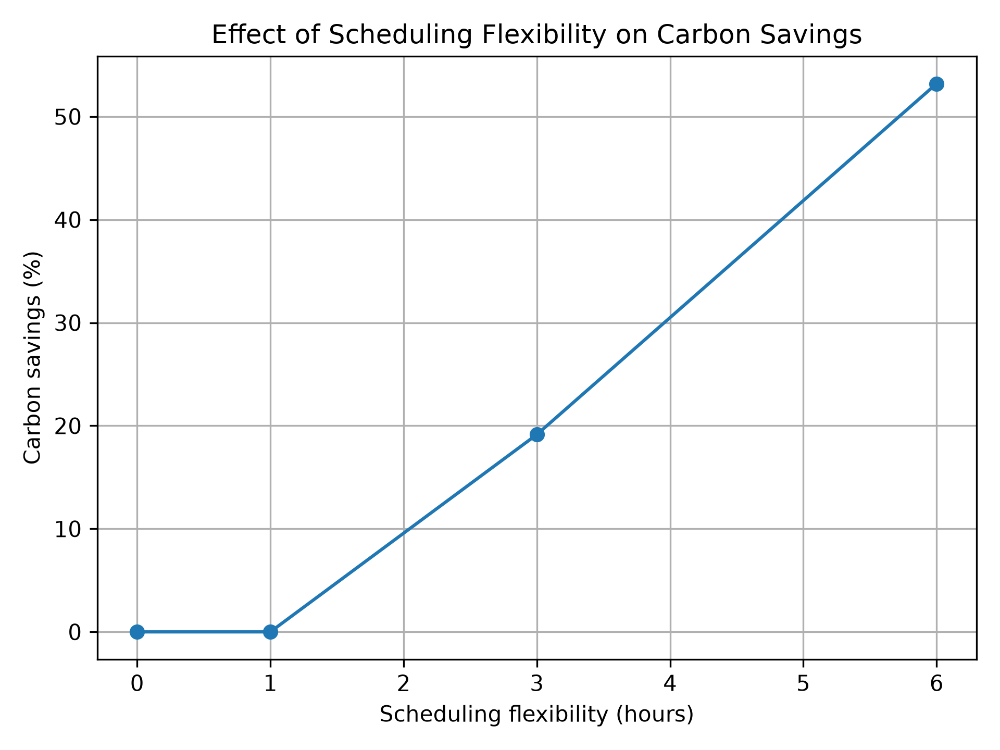
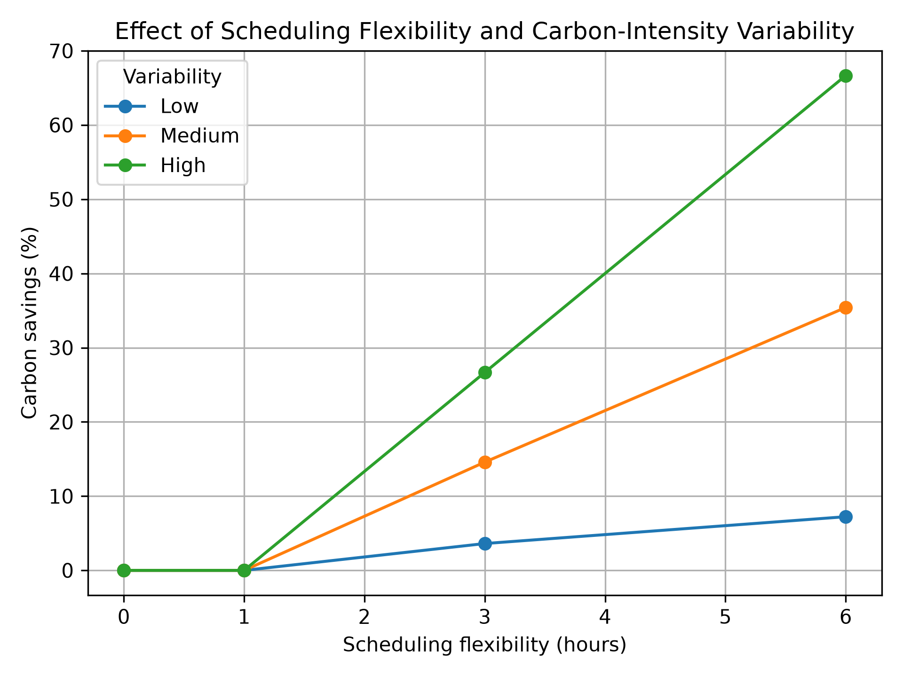
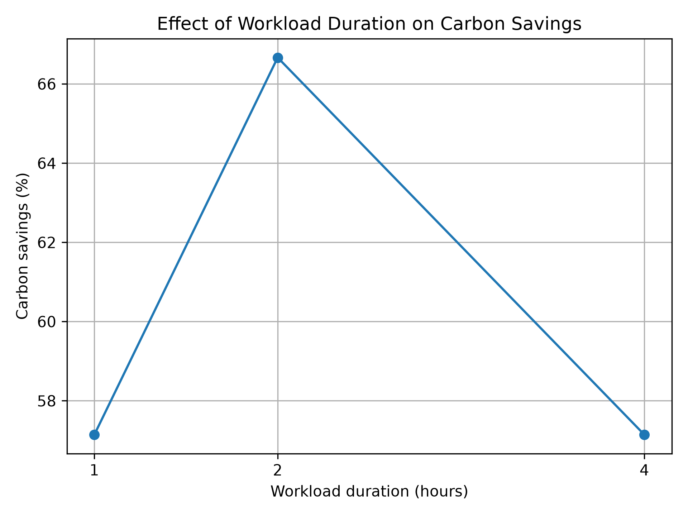

# Carbon-Aware Workload Scheduling: Investigating the Impact of Scheduling Flexibility

## 1. Introduction

The carbon emissions associated with computing depend not only on the
amount of energy consumed, but also on the carbon intensity of the
electricity used at the time that computation takes place. Where
workloads have flexible execution times, it may therefore be possible
to reduce their operational carbon emissions by shifting execution
towards periods of lower carbon intensity.

This project develops a Python-based simulation of a simple
carbon-aware workload scheduler. The simulator compares a baseline
approach, in which a workload executes as soon as it becomes available,
with a carbon-aware approach that searches the available scheduling
window for the lowest-carbon execution time.

Rather than attempting to model a production scheduling system, the
project uses a deliberately small and transparent model to investigate
how scheduling constraints and carbon-intensity patterns affect the
theoretical potential for carbon reduction.

## 2. Research Question

The primary research question is:

**How does workload flexibility affect the potential carbon savings
achievable through temporal workload shifting?**

Two additional factors are investigated:

1. How does temporal variability in carbon intensity affect the value
   of scheduling flexibility?
2. How does workload duration interact with the availability of
   lower-carbon execution periods?

## 3. Background

The carbon emissions associated with electricity consumption depend on the carbon intensity of the electricity supply. Carbon intensity can vary across both time and location as the generation mix of an electricity grid changes.

The Green Software Foundation's Software Carbon Intensity (SCI) specification provides a standardised methodology for measuring the carbon impact of software. The SCI model incorporates the energy consumed by software, the carbon intensity of the electricity used, and the embodied emissions associated with the hardware on which the software operates (Green Software Foundation, 2026). Carbon intensity is therefore one factor through which the timing and location of computation can affect operational emissions.

Carbon-aware computing uses information about electricity carbon intensity when making computing decisions. For workloads whose execution time is flexible, one possible strategy is temporal shifting: delaying computation from a higher-carbon period to a lower-carbon period while still satisfying workload constraints such as deadlines.

This approach has been investigated in large-scale computing systems. Google's Carbon-Intelligent Computing system, for example, uses carbon-intensity forecasts to help manage temporally flexible datacentre workloads (Radovanovic et al., 2021). Research into carbon-aware cloud scheduling has also examined how the achievable benefit of temporal workload shifting is affected by workload characteristics and constraints, including job duration and deadlines (Sukprasert et al., 2023).

Great Britain's National Energy System Operator (NESO) provides carbon-intensity data programmatically through its Carbon Intensity API (National Energy System Operator, n.d.). This demonstrates how time-varying grid carbon data can be made available to applications that aim to schedule electricity consumption towards lower-carbon periods.

The simulator developed in this project focuses specifically on this temporal scheduling problem. It models operational emissions using workload energy consumption and time-varying carbon intensity while deliberately excluding embodied emissions and other components that would be required for a complete SCI calculation.

## 4. Methodology

The simulator represents a computational workload as a `Job` with four
properties: duration, earliest start time, deadline and power
consumption. Jobs are non-preemptive, meaning that once execution
begins, the workload runs continuously until completion.

Carbon-intensity data is represented as an hourly time series measured
in grams of carbon dioxide equivalent per kilowatt-hour
(gCO2e/kWh). The current model therefore makes scheduling decisions at
one-hour intervals.

### 4.1 Baseline Scheduler

The baseline scheduler represents a system with no carbon-aware
optimisation. It schedules each workload at its earliest permitted
start time.

This provides a reference against which the emissions of the
carbon-aware scheduler can be compared.

### 4.2 Carbon-Aware Scheduler

The carbon-aware scheduler performs an exhaustive search over all valid
hourly start times within the workload's scheduling window.

The latest valid start time is calculated as:

`latest start = deadline - workload duration`

For each candidate start time, the scheduler constructs the complete
execution window and retrieves the carbon intensity associated with
each hour of execution. It then estimates the total operational carbon
emissions for that candidate.

The candidate with the lowest calculated emissions is selected.

An exhaustive search was chosen deliberately because the simulated
scheduling windows are small. This keeps the optimisation process
deterministic, transparent and easy to validate rather than introducing
additional optimisation complexity that is unnecessary for the
research question.

### 4.3 Emissions Model

For each one-hour interval, energy consumption is calculated as:

`Energy (kWh) = Power (kW) × Time (h)`

Operational carbon emissions are then calculated as:

`Emissions (gCO2e) = Energy (kWh) × Carbon Intensity (gCO2e/kWh)`

For workloads lasting multiple hours, the emissions calculated for
each hourly interval are summed to produce the total emissions for the
job.

The percentage carbon saving produced by carbon-aware scheduling is
calculated as:

`Saving (%) = ((Baseline emissions - Green emissions) / Baseline emissions) × 100`

### 4.4 Input Validation and Data Quality

The workload model validates that duration and power consumption are
positive, that the deadline occurs after the earliest start time, and
that the workload can complete within its permitted scheduling window.

The scheduler also requires carbon-intensity data for every interval
used when evaluating candidate execution windows. If required data is
missing, the current implementation raises an explicit error rather
than making a scheduling decision using incomplete information.

This behaviour was chosen because the quality and completeness of
carbon-intensity data can directly affect the validity of a
carbon-aware scheduling decision.

## 5. Experimental Design

Three experiments were designed to investigate different factors that
may influence the effectiveness of temporal carbon-aware scheduling.
Synthetic carbon-intensity data was used so that specific scheduling
conditions could be controlled and examined independently.

The experiments do not attempt to estimate the carbon savings of a
real production system. Instead, they investigate the behaviour of the
scheduler under defined conditions and demonstrate the theoretical
potential of temporal workload shifting.

### 5.1 Experiment 1: Scheduling Flexibility

The first experiment investigated the primary research question by
varying the amount of time by which a workload could be delayed.

A two-hour workload with a constant power requirement of 1 kW was
available from 09:00. Four levels of scheduling flexibility were
evaluated:

- 0 hours
- 1 hour
- 3 hours
- 6 hours

For each flexibility level, the deadline was calculated as the earliest
start time plus the workload duration and permitted flexibility.

Both the baseline and carbon-aware schedulers were executed against the
same synthetic carbon-intensity trace. This allowed the effect of
increasing the available scheduling window to be observed while keeping
the workload itself constant.

### 5.2 Experiment 2: Carbon-Intensity Variability

The second experiment investigated whether the value of scheduling
flexibility changes when carbon intensity varies by different amounts
over time.

Three synthetic carbon-intensity scenarios were constructed: low,
medium and high variability. Each scenario had the same mean carbon
intensity of 200 gCO2e/kWh, reducing the influence of differences in
average carbon intensity between scenarios.

Their population standard deviations were:

| Scenario | Mean (gCO2e/kWh) | Standard deviation (gCO2e/kWh) |
| --- | ---: | ---: |
| Low variability | 200.0 | 5.8 |
| Medium variability | 200.0 | 31.6 |
| High variability | 200.0 | 80.0 |

The same two-hour, 1 kW workload was evaluated with 0, 1, 3 and 6 hours
of flexibility in each scenario.

The synthetic traces were designed with increasing variation around the
same mean rather than as representations of real electricity-grid
conditions. This makes the comparison useful as a controlled simulation,
while limiting the extent to which the numerical savings can be
generalised to real systems.

### 5.3 Experiment 3: Workload Duration

The third experiment investigated how workload duration interacts with
the timing of lower-carbon periods.

Workloads of 1, 2 and 4 hours were tested against the same synthetic
carbon-intensity trace. Each workload had a constant power requirement
of 1 kW and was given six hours of scheduling flexibility.

Keeping the flexibility allowance constant meant that each workload
could delay its start by the same maximum amount, while workload
duration was varied.

The carbon-intensity trace contained a pronounced lower-carbon period.
This allowed the experiment to investigate whether workloads of
different lengths could exploit the same low-carbon window equally
effectively.

## 6. Results

### 6.1 Scheduling Flexibility

The first experiment showed that increasing scheduling flexibility can
allow the carbon-aware scheduler to select lower-carbon execution
windows.

| Flexibility | Baseline start | Green start | Baseline emissions (gCO2e) | Green emissions (gCO2e) | Saving |
| ---: | --- | --- | ---: | ---: | ---: |
| 0h | 09:00 | 09:00 | 470 | 470 | 0.0% |
| 1h | 09:00 | 09:00 | 470 | 470 | 0.0% |
| 3h | 09:00 | 12:00 | 470 | 380 | 19.1% |
| 6h | 09:00 | 15:00 | 470 | 220 | 53.2% |

With no flexibility, the baseline and carbon-aware schedulers produced
the same result because the workload could not be delayed. One hour of
flexibility also produced no saving because the additional feasible
execution window was not lower carbon than the baseline window.

At three hours of flexibility, the scheduler shifted execution to
12:00 and reduced calculated emissions by 19.1%. With six hours of
flexibility, it selected 15:00 and achieved a calculated reduction of
53.2% relative to the baseline.

### 6.2 Carbon-Intensity Variability

The second experiment produced the following percentage savings:

| Flexibility | Low variability | Medium variability | High variability |
| ---: | ---: | ---: | ---: |
| 0h | 0.0% | 0.0% | 0.0% |
| 1h | 0.0% | 0.0% | 0.0% |
| 3h | 3.6% | 14.6% | 26.7% |
| 6h | 7.2% | 35.4% | 66.7% |

At zero and one hour of flexibility, no carbon reduction was observed
in any of the three scenarios.

At three hours of flexibility, savings increased from 3.6% in the
low-variability scenario to 14.6% in the medium-variability scenario
and 26.7% in the high-variability scenario.

At six hours of flexibility, the difference became larger: 7.2%,
35.4% and 66.7% savings were observed for the low-, medium- and
high-variability scenarios respectively.

### 6.3 Workload Duration

The workload-duration experiment produced the following results while
holding scheduling flexibility at six hours:

| Duration | Baseline start | Green start | Baseline emissions (gCO2e) | Green emissions (gCO2e) | Saving |
| ---: | --- | --- | ---: | ---: | ---: |
| 1h | 09:00 | 15:00 | 280 | 120 | 57.1% |
| 2h | 09:00 | 15:00 | 600 | 200 | 66.7% |
| 4h | 09:00 | 14:00 | 1120 | 480 | 57.1% |

The two-hour workload produced the largest percentage saving at 66.7%.
The one- and four-hour workloads both produced savings of 57.1%.

The optimum start time also changed for the longer workload. The
one- and two-hour jobs started at 15:00, whereas the four-hour job
started at 14:00.

## 7. Discussion

The experiments demonstrate that scheduling flexibility can create
opportunities to reduce the operational carbon emissions of flexible
computational workloads. However, flexibility does not itself guarantee
a reduction. Its value depends on whether lower-carbon execution
periods become available within the additional scheduling window.

This is demonstrated clearly by the first experiment. Increasing
flexibility from zero to one hour produced no saving because the newly
available execution period was not cleaner than the baseline period.
When flexibility increased to three and six hours, lower-carbon windows
became accessible and the scheduler was able to reduce calculated
emissions.

### 7.1 Interaction Between Flexibility and Carbon-Intensity Variability

The second experiment indicates that the potential value of scheduling
flexibility is strongly influenced by temporal variation in carbon
intensity.

The three synthetic scenarios had the same mean carbon intensity but
different levels of variation. Under low variability, six hours of
flexibility produced a saving of only 7.2%. Under medium variability
this increased to 35.4%, while the high-variability scenario produced
a saving of 66.7%.

In these controlled scenarios, greater variation created a larger
difference between higher- and lower-carbon execution periods. This
gave the scheduler more valuable opportunities to shift computation.

The result also illustrates why average carbon intensity alone is not
sufficient to describe the potential benefit of temporal scheduling.
Two periods with the same average carbon intensity may offer very
different scheduling opportunities depending on how carbon intensity
changes over time.

These results should not be interpreted as evidence that higher grid
variability will always produce a particular level of carbon saving.
The scenarios are synthetic and contain deliberately constructed
temporal patterns. Instead, they demonstrate the mechanism through
which temporal variation can affect the usefulness of scheduling
flexibility.

### 7.2 Interaction Between Workload Duration and Carbon Intensity

The third experiment shows that workload duration also affects the
ability of a scheduler to exploit lower-carbon periods.

The relationship was not monotonic. The two-hour workload achieved a
larger percentage saving than either the one-hour or four-hour
workloads. This occurred because the two-hour workload aligned
particularly well with the lowest-carbon portion of the synthetic
trace.

The four-hour workload could not execute entirely within this narrow
low-carbon period and therefore also consumed electricity during
surrounding higher-carbon intervals.

This suggests that the carbon-saving potential of workload shifting
depends not only on how long a workload can be delayed, but also on the
relationship between workload duration and the shape and duration of
lower-carbon periods.

### 7.3 Implications for Carbon-Aware Scheduling

Taken together, the experiments suggest that carbon-aware scheduling
is a constraint-dependent optimisation problem.

Scheduling flexibility defines the set of feasible execution times,
while the carbon-intensity signal determines whether useful
lower-carbon alternatives exist within that set. Workload duration
then determines how effectively a workload can fit within those
lower-carbon periods.

Therefore, a scheduler cannot determine the value of temporal shifting
from a single factor such as flexibility alone. The potential benefit
emerges from the interaction between workload constraints and the
time-varying carbon-intensity signal.

The simulator also highlights the importance of input-data quality.
A scheduler that optimises against incomplete or invalid
carbon-intensity data may make an unreliable decision. For this reason,
the implementation explicitly rejects candidate evaluation when
required carbon-intensity data is missing rather than silently treating
incomplete data as valid.

## 8. Limitations

The simulator is intentionally simplified and the experimental results
should be interpreted within several limitations.

First, the experiments use synthetic carbon-intensity data rather than
historical or forecast electricity-grid data. This allows specific
conditions to be controlled, but the numerical carbon savings reported
by the experiments should not be interpreted as estimates of savings
that would necessarily occur in a real deployment.

Second, the scheduler assumes perfect knowledge of future carbon
intensity. In practice, a scheduler making decisions about future
execution periods would often rely on forecasts, which may contain
uncertainty or error.

Third, workloads are represented using a constant power requirement.
Real computational workloads may have power consumption that changes
throughout execution.

The current simulator also considers one non-preemptive workload at a
time. It does not model competition between workloads for finite
compute capacity, workload priorities, dependencies, or other resource
constraints that would be present in a production scheduling system.

Scheduling decisions are made at hourly resolution. A finer temporal
resolution could expose additional scheduling opportunities and more
accurately represent shorter workloads, but would also increase the
amount of data and number of candidate scheduling decisions.

Finally, the emissions model considers operational emissions associated
with electricity consumption. It does not attempt to calculate the
embodied emissions associated with manufacturing and operating the
underlying computing infrastructure.

These limitations mean that the project is best interpreted as an
investigation of carbon-aware scheduling behaviour under controlled
conditions rather than as a prediction of real-world carbon savings.

## 9. Future Work

A natural next step would be to evaluate the scheduler using historical
or forecast carbon-intensity data from a real electricity grid. This
would allow the scheduling approach to be evaluated against realistic
temporal patterns and over longer periods.

Forecast uncertainty could also be introduced by comparing scheduling
decisions made using forecast carbon intensity with the emissions
calculated from the subsequently observed values. This would help
investigate how forecast error affects scheduling performance.

The workload model could be extended to support multiple jobs competing
for limited compute capacity. This would introduce additional
constraints and allow different scheduling strategies to be compared
when not every workload can occupy its individually optimal
low-carbon period.

Further extensions could include variable power profiles, finer
scheduling resolution, workload priorities, pre-emptible workloads and
additional service-level constraints.

Finally, alternative policies for incomplete carbon-intensity data
could be investigated. The current implementation rejects incomplete
input explicitly, while future versions could compare approaches such
as interpolation, excluding affected execution windows or falling back
to non-carbon-aware scheduling.

## 10. Conclusion

This project investigated how workload flexibility affects the
theoretical carbon-saving potential of temporal workload shifting.

A Python simulator was developed to compare immediate baseline
execution with a carbon-aware scheduler that searches feasible
execution windows and selects the option with the lowest calculated
operational emissions.

The experiments showed that increased scheduling flexibility can
produce substantial carbon savings when it exposes lower-carbon
execution periods, but flexibility alone does not guarantee a
reduction. In the synthetic scenarios tested, the benefit of
flexibility increased as temporal carbon-intensity variation increased.

The workload-duration experiment further demonstrated that the
relationship between workload characteristics and carbon savings is
not necessarily monotonic. The effectiveness of shifting depends on
how the duration of a workload aligns with available lower-carbon
periods.

Overall, the results suggest that the potential benefit of
carbon-aware temporal scheduling emerges from the interaction between
workload constraints and time-varying carbon intensity. Although the
current simulator is deliberately simplified, it provides a
transparent and testable foundation for investigating more realistic
carbon-aware scheduling scenarios.

## 11. References

Green Software Foundation (2026) *Software Carbon Intensity (SCI)*.
Available at: https://greensoftware.foundation/standards/sci/
(Accessed: 5 October 2026).

National Energy System Operator (n.d.) Carbon Intensity API.
Available at: https://api.carbonintensity.org.uk/
(Accessed: 5 October 2026).

Radovanovic, A., Koningstein, R., Schneider, I., Chen, B., Duarte, A.,
Roy, B., Xiao, D., Haridasan, M., Hung, P., Care, N., Talukdar, S.,
Mullen, E., Smith, K., Cottman, M.E. and Cirne, W. (2021)
'Carbon-Aware Computing for Datacenters', arXiv:2106.11750.

Sukprasert, T., Souza, A., Bashir, N., Irwin, D. and Shenoy, P. (2023)
'On the Limitations of Carbon-Aware Temporal and Spatial Workload
Shifting in the Cloud', arXiv:2306.06502.